<!--
  菜谱数据文件。每道菜用一个一级标题（# 菜名）分隔。
  下面可以写 ## 标准做法 / ## 我的做法 / ## 图片 三个小节（小节名随意，页面照原样显示）。
  ## 图片 下面写 markdown 图片，路径相对本文件所在目录，例如  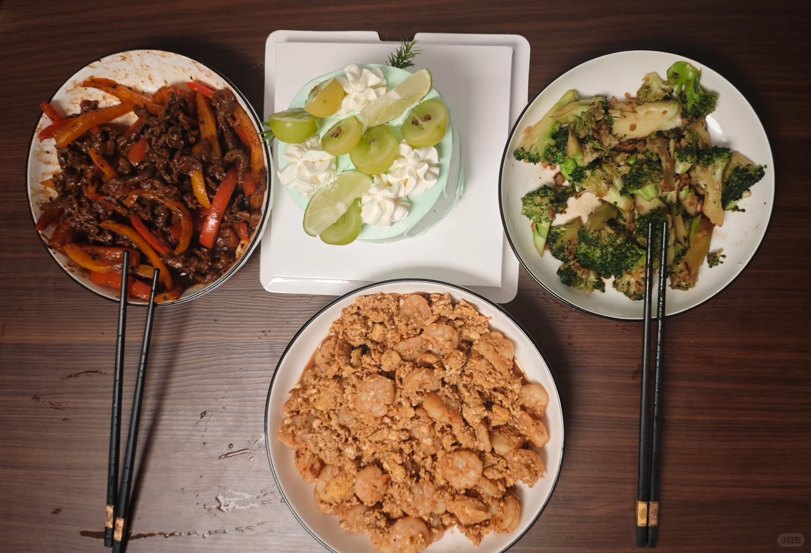
-->

# 煎鸡蛋

## 标准做法
**食材**：鸡蛋 2 个、盐
1. 鸡蛋打散，加一小撮盐搅匀。
2. 热锅凉油（锅先烧热再倒油），油热后倒蛋液。
3. 边缘鼓起凝固再推炒几下，整体金黄就出锅 —— 余温还会继续熟，别炒过。

## 我的做法
- week1：第一次练习，**成功** ✌️
- 结论：这道的要点只有火候，后面所有炒蛋都用同一套。
- 6/13 周六又单练了一次（鸡蛋 2 个）：练「嫩」的手感 —— 宁可早出锅，余温还会再熟一点，别炒过。

## 图片
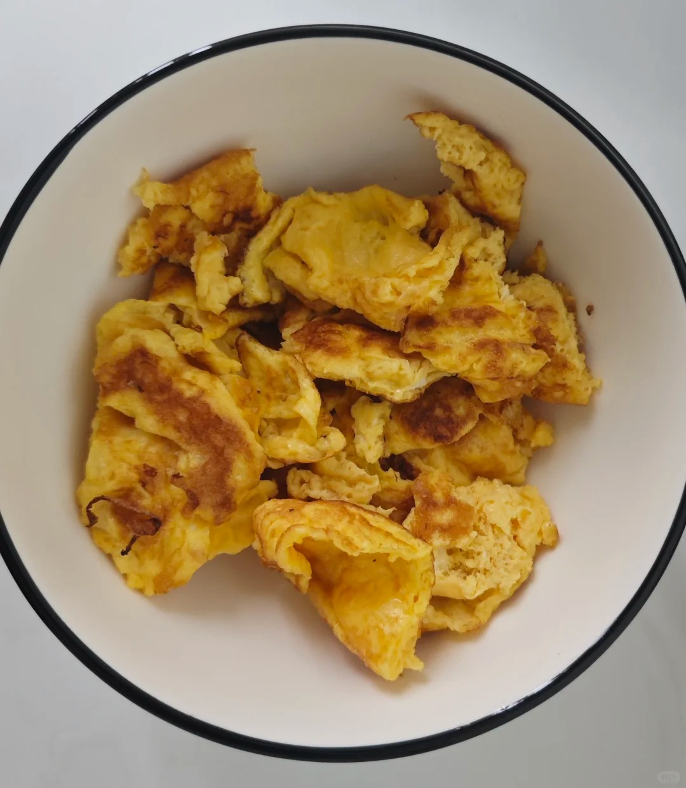

# 红薯叶挂面

## 标准做法
**食材**：挂面 100g/人（两人共 200g）、红薯叶约 150g/人
1. 水开下面条。
2. 中途下红薯叶。
3. 煮到面熟即可。

## 我的做法
- 6/13 周六（两人份）：第一次做。
- ⚠️ 后段泡沫水容易扑锅 → 转中火 + 锅盖留条缝；**点几次凉水**（你的点水做法是对的）。

## 图片
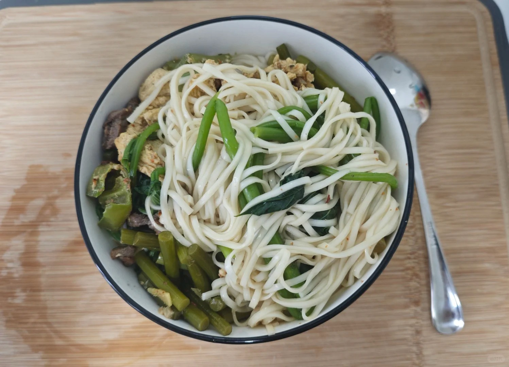

# 蒜苔炒牛肉

## 标准做法
**食材**：蒜苔 200g、牛肉条 200g（两人份）
**腌料**：酱油 + 香油 + 料酒 + 玉米淀粉 + 少许盐，抓匀腌 15–20 分钟
1. 热锅凉油，**油别多**，先下蒜姜爆香。
2. 下牛肉条，炒到变色就盛出。
3. 下蒜苔炒到表皮起皱。
4. 倒回牛肉，加盐 + 生抽翻匀出锅 —— **全程不加水**。

## 我的做法
- week1：**基本失败**，最后改成水煮做捞面浇头。
- 6/13 周六（两人份）：腌得到位，**牛肉很嫩** ✅
- ⚠️ 油放多了溅到手 → 下次少油，食材贴着锅边滑下去。
- ⚠️ 忘了蒜姜、最后加水变成「煮菜」→ 蒜姜先下锅，全程不加水。
- ⚠️ 调料太杂盖住本味（这次加了十三香 / 辣椒面 / 胡椒粉）→ 只留盐 + 生抽。

## 图片

# 青椒炒鸡蛋

## 标准做法
**食材**：青椒约 300g、鸡蛋 5 个（两人份）
1. 青椒去籽切块（**去籽省事法**：切开后用手捏住蒂往里一推，整圈籽带筋一起出来）。
2. 蛋打散加少许盐，热锅凉油**先炒蛋**到金黄，盛出。
3. 补油**先下蒜姜爆香**，再下青椒炒到变软。
4. **倒回蛋**，加盐 + 生抽翻匀出锅 —— 不加水。

## 我的做法
- week1：**基本失败**，最后改成水煮做捞面浇头。
- 6/13 周六：**顺序反了**（先炒的青椒）→ 记住「先炒蛋盛出、最后回锅」。
- ⚠️ 蒜姜加晚了 → 油热先下蒜姜。
- ⚠️ 最后加水煮了 → 炒菜不加水。
- 后面 week5 用「青椒切碎拌进蛋液」的做法重做了一次，效果好很多。

## 图片

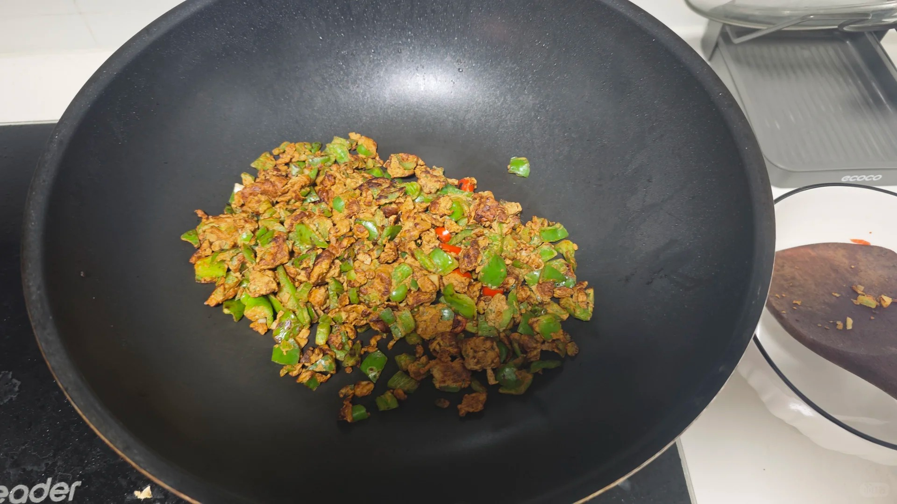

# 青椒炒肉（猪里脊 / 牛肉）

## 标准做法
**食材**：青椒 300g、肉（猪里脊或牛肉条）200g（两人份）
**腌料**：生抽 + 料酒 + 玉米淀粉 + 少许盐，腌 15 分钟
1. 肉切片或条，按上面腌好。
2. 热锅凉油，下肉炒到**全部变白**（约 1 分钟，切开不见粉红），盛出。
3. 补油**先下蒜姜爆香**，再下青椒大火炒到变软起虎皮。
4. 倒回肉，加盐 + 生抽（想要点甜加少许糖），快速翻匀出锅 —— **全程不加水**。

## 我的做法
- week1：青椒炒牛肉**部分成功**。调料（酱油、生抽、料酒、蚝油）**量要适当减轻** —— 到 week1 结束我还没搞清到底该放哪个。
- week3：青椒炒猪里脊，按这套做稳了。
- 6/13 周六再练：⚠️ 又忘了蒜姜、最后加水 → 蒜姜先下锅、不加水；⚠️ 肉炒到变色就盛出，别炒久。

## 图片
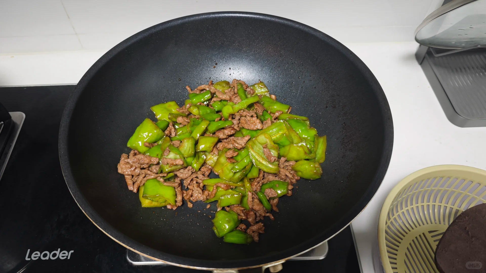
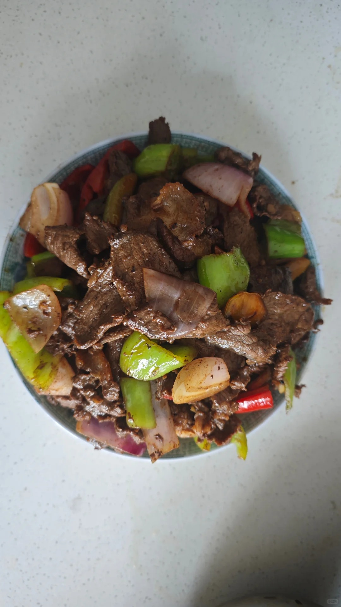

# 西兰花炒虾仁

## 标准做法
**食材**：西兰花 300g、虾仁 150g
**腌虾仁**：少许盐 + 白胡椒 + 料酒 + 一小勺玉米淀粉，腌 10 分钟
1. 虾仁解冻后**用厨房纸彻底沥干**再腌。
2. 西兰花切小朵，水里加盐和油焯 1–2 分钟变翠绿，**过一下凉水**保脆，沥干。
3. 热锅凉油，下虾仁炒到**刚变粉红打卷就盛出**（1–2 分钟，炒老就硬）。
4. 补油**先下蒜末爆香**，下西兰花大火快炒，倒回虾仁加盐翻匀 —— 不加水。

## 我的做法
- week1：**部分成功**，最后也加水煮了。
- 待解决：冷冻虾仁更好的解冻腌制方式；厨房纸沥干很关键。
- 6/14 计划里的版本要点：西兰花**先焯水**，光靠炒炒不透、还发硬。

## 图片
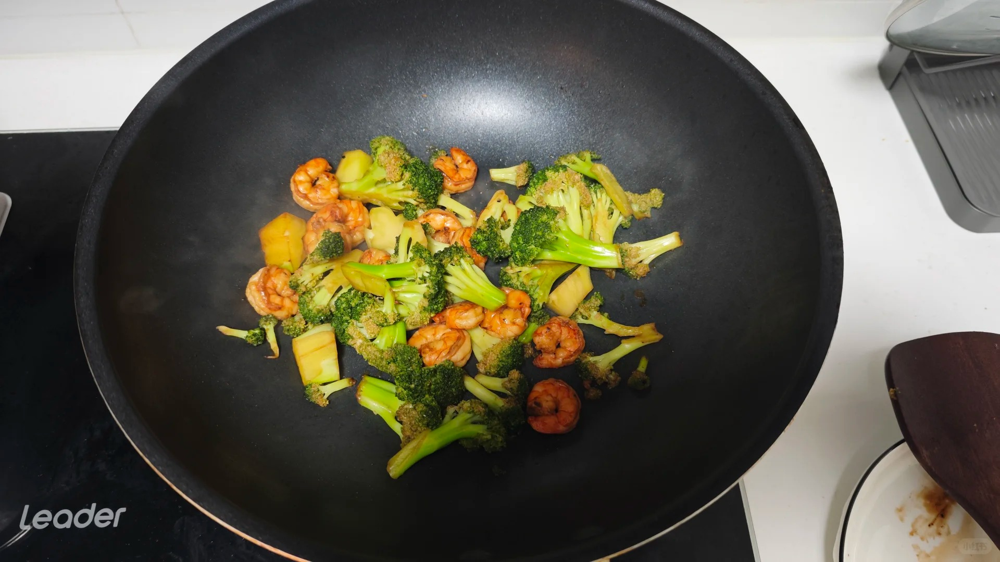

# 胡萝卜炒鸡腿肉

## 标准做法
**食材**：鸡腿肉 300g、胡萝卜 1 根、生抽、蚝油、料酒、淀粉、葱姜
1. 鸡腿肉切块，加生抽 + 葱姜 + 料酒 + **玉米淀粉**抓匀腌 15 分钟。
2. 热锅凉油下鸡肉，炒到表面金黄。
3. 下胡萝卜片炒软，加蚝油 + 老抽上色，大火收汁。

## 我的做法
- week2：味道还可以，胡萝卜有淡淡甜味。
- 份量：600g 鸡腿肉 + 1 根胡萝卜，俩人餐**偏多**（下次减到 400g）。
- 腌制时**忘记放玉米淀粉了，但分不出区别** —— 说明这道菜淀粉不是必需。

## 图片
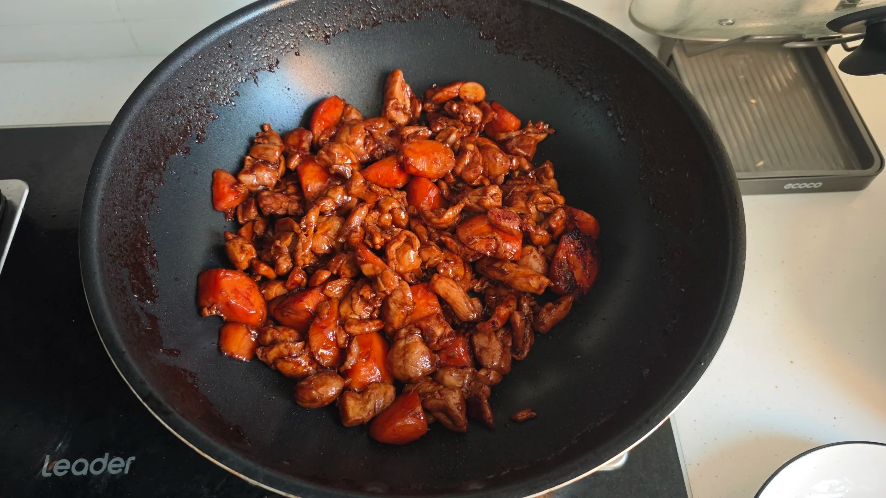

# 青椒片炒土豆片

## 标准做法
**食材**：土豆 2 个、青椒 2 个、蒜末、生抽、蚝油、盐、醋
1. 土豆切**薄片**（不会切丝就别硬切，片更好炒匀），泡水冲掉淀粉后沥干。
2. 热锅凉油，**先下蒜末爆香**再下土豆片，大火翻炒。
3. 加生抽 + 蚝油 + 盐，沿锅边淋一点醋。
4. 断生带脆就出锅。

## 我的做法
- week2：卖相好看，但**味道太寡淡**。
- 复盘出的两个原因：① 热油时**没放蒜片姜片**（懒得搞），炒土豆时也没加料，只有最后加了点生抽、蚝油、葱姜料酒汁和盐；② **食材量太大**，料摊薄了。
- 土豆片和青椒片**焯过水，确实更脆**一些。

## 图片
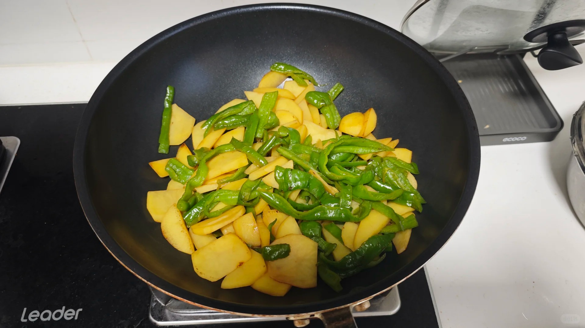

# 醋溜娃娃菜（可加虾仁）

## 标准做法
**食材**：娃娃菜 1 颗、蒜末、醋、盐、葱姜料酒汁
1. 娃娃菜竖切成两种菜，炒的时候分两盘 —— 或先切小一点，一锅能炒下。
2. 热锅凉油**先爆香蒜末**，再下娃娃菜大火炒。
3. 直接倒醋 + 葱姜料酒汁 + 盐。
4. 需要的话加 2/3 小碗凉水，烧一两分钟收汁。

## 我的做法
- week2：**科研成功**，味道可以，但卖相不太好看。
- 两个坑：① 爆油时又**没放料**，全靠后面倒醋救回来；② 娃娃菜切开太大，临时变成两道菜。
- 虾仁炒得太糊不好看 —— 还是**不会翻勺**导致的，虾仁建议单独炒好最后再放。

## 图片
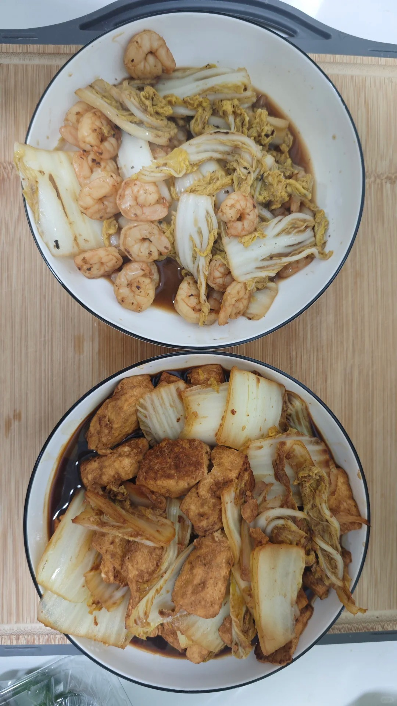

# 娃娃菜烧豆腐

## 标准做法
**食材**：娃娃菜 1 颗、豆腐 1 块、蒜末、生抽、蚝油、老抽、盐
1. 豆腐切块（**横切一刀会太厚**，直接切麻将块）。
2. 热锅凉油煎豆腐到两面金黄。
3. 下娃娃菜 + 蒜末，加生抽 + 蚝油 + 少量水，焖 3 分钟。
4. **最后点老抽上色**，收汁出锅。

## 我的做法
- week2：老抽上色的时候**挺惊艳**，这次值得记下来。
- 两个问题：① 点水有点多、焖得太久，最后**汁水还有很多**；② 豆腐横切了一次，感觉有点厚。

## 图片

# 土豆片烧大虾

## 标准做法
**食材**：大虾 8 只、土豆 1 个、青椒红椒各半个、生抽、蚝油、十三香、葱姜
1. 大虾加生抽腌一下。
2. 热锅凉油下葱姜爆香，下土豆片炒到半熟。
3. 下大虾和青红椒，加生抽 + 蚝油 + 十三香。
4. 收汁出锅。

## 我的做法
- week3：青椒 + 红椒 + 生抽腌制，葱姜热油，生抽蚝油十三香收汁 —— 这套配料对了。

## 图片
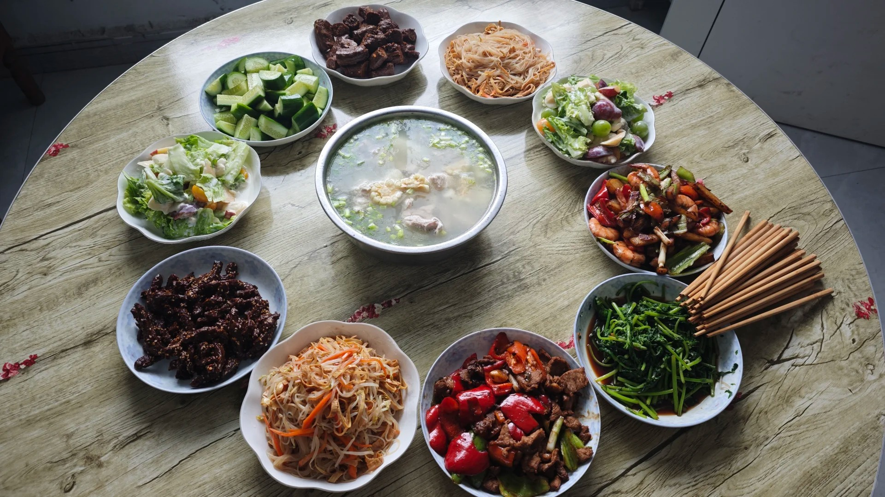

# 炖排骨玉米山药

## 标准做法
**食材**：排骨 500g、玉米 1 根、山药 1 段、姜、葱、盐
1. 排骨冷水下锅焯水，撇掉浮沫捞出。
2. 重新加开水，放姜葱，小火炖 40 分钟。
3. 下玉米段炖 15 分钟。
4. **山药最后 10 分钟再放**（放早会化掉），加盐出锅。

## 我的做法
- week3：很成功。

## 图片

# 鱼香肉丝

## 标准做法
**食材**：猪里脊 200g、木耳、胡萝卜、青椒、泡椒/豆瓣酱、糖、醋、生抽、淀粉
1. 肉切丝，加生抽 + 料酒 + 淀粉腌 10 分钟。
2. 调鱼香汁：糖 + 醋 + 生抽 + 淀粉 + 水（糖醋比例大致 1:1）。
3. 肉丝炒到变白盛出；下豆瓣酱炒出红油，下配菜丝炒软。
4. 倒回肉丝，淋鱼香汁，大火收浓。

## 我的做法
- week3：**很成功**，我只能说。

## 图片
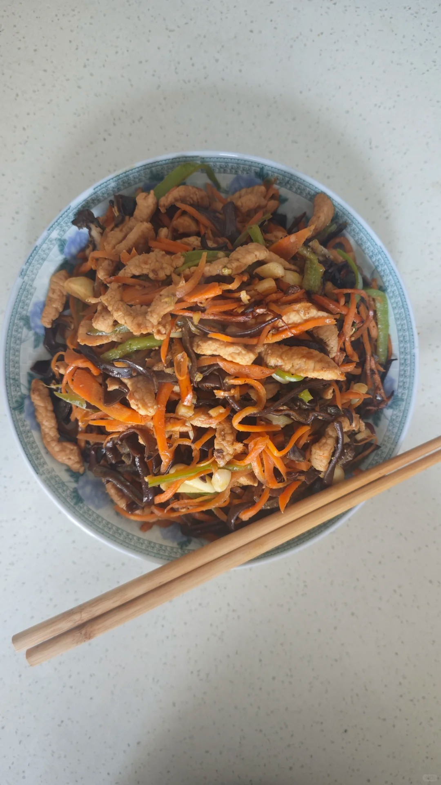

# 青椒洋葱牛肉

## 标准做法
**食材**：牛肉 150g、洋葱半个、青椒 1 个、生抽、蚝油、黑胡椒、淀粉
1. 牛肉切片，加生抽 + 淀粉 + 一点油腌 10 分钟。
2. 热锅凉油下牛肉炒到变色盛出。
3. 下洋葱炒到透明、青椒炒软。
4. 倒回牛肉，加蚝油 + 黑胡椒翻匀。

## 我的做法
- week3：新加的一道，加入了洋葱。

## 图片

# 烩菜

## 标准做法
**食材**：木耳、腐竹（**提前泡**）、猪肉、豆腐丝、冬瓜、豆角、西红柿
1. 木耳腐竹提前泡发；肉切片先炒香。
2. 下西红柿炒出汁，再加冬瓜、豆角翻炒。
3. 加水没过，下木耳、腐竹、豆腐丝，焖 10 分钟。
4. 加盐收汁。

## 我的做法
- week3：河南烩菜，有什么下什么。

# 凉拌茼蒿

## 标准做法
**食材**：茼蒿 1 把、蒜末、生抽、醋、香油、盐
1. 茼蒿洗净，**沸水焯 20 秒**立刻捞出过凉水。
2. 挤干水分切段。
3. 加蒜末 + 生抽 + 醋 + 香油 + 盐拌匀。

## 我的做法
- week3：不用开火太久，焯完就有味道。

## 图片

# 凉拌豆皮豆芽粉丝

## 标准做法
**食材**：豆皮、绿豆芽、粉丝、蒜末、生抽、醋、辣椒油
1. 粉丝提前泡软；豆芽、豆皮沸水焯熟；粉丝煮到透明。
2. 全部过凉水沥干。
3. 加蒜末 + 生抽 + 醋 + 辣椒油拌匀。

## 我的做法
- week3：粉丝煮到**无色透明**就是熟了 —— 这条对速食也适用。

## 图片

# 水果生菜沙拉

## 标准做法
**食材**：生菜、黄瓜、小番茄、青提、西梅、苹果、香蕉、酸奶
1. 生菜黄瓜洗净切块。
2. 水果切块。
3. 全部拌一起，淋酸奶。

## 我的做法
- week2 / week3：**不用开火的兜底菜**，懒得动火的时候做这个。

## 图片
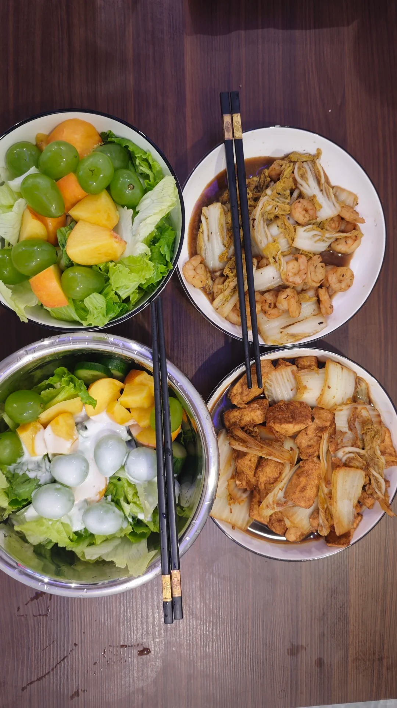

# 彩椒番茄炒牛肉

## 标准做法
**食材**：牛肉丝 150g、彩椒 180g、番茄 1 颗
**腌制**：生抽、料酒、黑胡椒、玉米淀粉、一点油
1. 牛肉丝腌 10 分钟。彩椒切丝（**胖彩椒再对半切一下**），焯水备用。
2. 热锅凉油煎牛肉，变色就盛出。
3. 下番茄炒出汁 —— **锅太干就先加两勺水**，否则会糊。
4. 下彩椒丝，再下牛肉，老抽 + 蚝油收汁。

## 我的做法
- week4：番茄下锅时锅比较干、翻得不及时，**番茄糊了很多**。
- 料汁有点多了，下次减量。
- 彩椒丝可以再对半分一下，粗了不好熟。

## 图片

# 虾仁烧豆腐

## 标准做法
**食材**：虾仁 250g、豆腐 350g、鸡蛋 3 个
**腌制**：盐、料酒、白胡椒、玉米淀粉
1. 虾仁腌 10 分钟；豆腐切块下锅煎到两面黄。
2. 放虾仁，倒入**鸡蛋液**和料汁（老抽、蚝油、盐）。
3. 小火焖到蛋液凝固。

## 我的做法
- week4：买的**绢豆腐太嫩了**（下次用老豆腐或北豆腐）。
- 但是**和鸡蛋液搭配效果还可以**，只是卖相略逊。

## 图片

# 蒜蓉西兰花

## 标准做法
**食材**：西兰花 200g、蒜 5 瓣、盐、蚝油
1. 蒜切末 —— **week4 已经会切蒜末了** ✌️
2. 西兰花切小朵焯水 1 分钟。
3. 热锅凉油爆香蒜末（**蒜末别炒糊，变色就下菜**）。
4. 下西兰花大火翻炒，加盐 + 一点蚝油出锅。

## 我的做法
- week4：独立做成了，会切蒜末是这次最大的进步。

## 图片

# 爆炒鱿鱼花

## 标准做法
**食材**：鱿鱼花 300g、青椒 80g、红椒 150g、蒜末、小米辣
**料汁**：生抽、蚝油、黑胡椒、大蒜盐、清水
1. 鱿鱼花焯水 30 秒立刻捞出沥干（**久了就老**）。
2. 热锅凉油，蒜末 + 小米辣爆香。
3. 下鱿鱼花大火快炒，加青红椒。
4. 淋料汁，翻匀出锅。

## 我的做法
- week5：盐味有点淡，但**自然风味吃起来也还不错**。

## 图片
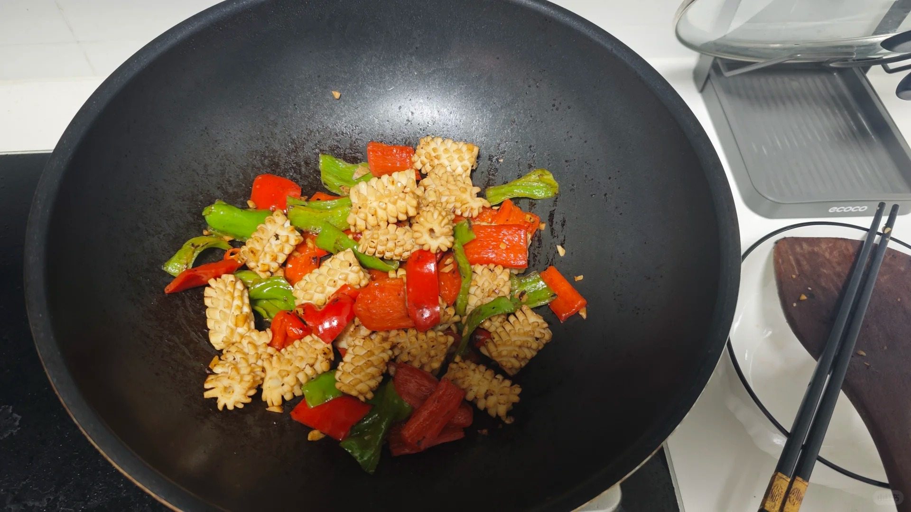

# 青椒碎炒鸡蛋

## 标准做法
**食材**：青椒 120g、鸡蛋 2 个、生抽、盐、鸡精、蒜末、小米辣
1. 青椒切碎，**和蛋液拌在一起**，加生抽 + 盐 + 鸡精。
2. 热锅凉油，蒜末 + 小米辣爆香。
3. 倒入混合蛋液，**大火快速翻炒**到凝固。
4. 收一下汁再出锅。

## 我的做法
- week5：味道还行，盐味稍微有点淡，清淡饮食也还行。

## 图片

# 禹州杂珂（速食）

## 标准做法
**食材**：速食杂珂 1 份、豆腐丝、酥肉羊杂、粉丝、调料包
1. 冷水 750ml（**别加多，超过 1L 会淡**）。
2. 下豆腐丝和酥肉羊杂，煮沸。
3. 下粉丝和调料包，煮到粉丝**无色透明**。
4. 加辣椒油拌匀。

## 我的做法
- week2：中午懒得开火的选择，**确实味道很不错**。
- 结论：**调料包有点说法**。

## 图片
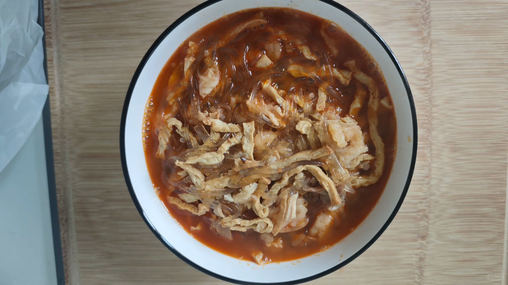

# 4 英寸水果蛋糕

## 标准做法
**食材**：蛋糕胚、淡奶油、当季水果
1. 蛋糕胚横切成两层。
2. 淡奶油打发到硬挺（**盆和奶油都要是冷的**）。
3. 夹层抹奶油 + 水果丁，盖上另一层。
4. 外面抹平，顶上摆水果。

## 我的做法
- week4：买的，4英寸2个人一顿差不多。

## 图片

